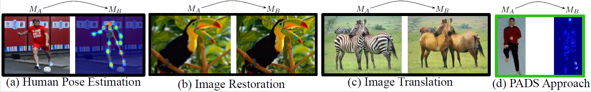
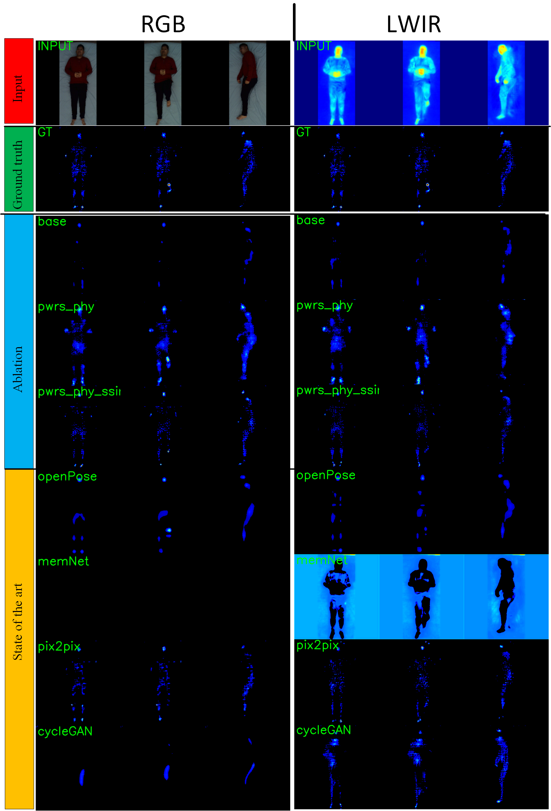

# Pressure Eye: In-bed Contact Pressure Estimation via Contact-less Imaging
This is the Pressure Eye (PEye) implementation to estimate in-bed human contact pressure with the bed surface.  Both IR and RGB top view image can be employed as vision source in the pressure map estimation. 

 
## Env Setup
This project is developed under python3.8/Anaconda 3. Please check requirements.txt for required packages. 

## Dataset deployments.  
- Apply the SLP dataset from [ACLab SLP](https://web.northeastern.edu/ostadabbas/2019/06/27/multimodal-in-bed-pose-estimation/)
- Point `--dataroot` to where all datasets are stored.  The vis-pressure dataset will be under it.  
- Get the pixel value distribution [statistics]([pwrs-phy-ssim-D](http://www.coe.neu.edu/Research/AClab/PEye/hist_pwrs100.json), extract to misc.

## pretrained models.
Please refer to our paper for the the specific configurations.

RGB: 
[pwrs-phy](http://www.coe.neu.edu/Research/AClab/PEye/vis2PM_exp_uc_RGB-2-PMarray_n_phy1_stg3_whtL-pwrs-100.0L2_lap0.001_sum1e-06_ssim0.0_D0.0L3.zip),
[pwrs-phy-ssim-D](http://www.coe.neu.edu/Research/AClab/PEye/vis2PM_exp_uc_RGB-2-PMarray_n_phy1_stg3_whtL-pwrs-100.0L2_lap0.001_sum1e-06_ssim10.0_D1.0L3.zip)

LWIR: 
[pwrs-phy](http://www.coe.neu.edu/Research/AClab/PEye/vis2PM_exp_uc_IR-2-PMarray_n_phy1_stg3_whtL-pwrs-100.0L2_lap0.001_sum1e-06_ssim0.0_D0.0L3.zip),
[pwrs-phy-ssim-D](http://www.coe.neu.edu/Research/AClab/PEye/vis2PM_exp_uc_IR-2-PMarray_n_phy1_stg3_whtL-pwrs-100.0L2_lap0.001_sum1e-06_ssim10.0_D1.0L3.zip)

## Getting Started
- To train (with RGB, physical vector 1,  pwrs,  ssim and D loss): 

`python train.py  --model vis2PM --mod_src RGB --mod_tar PMarray --n_phy 1 --type_whtL pwrs --lambda_sum 1e-6 --lambda_ssim 10 --lambda_D 1
`
- To test with similar configuration:

`python test.py  --model vis2PM --mod_src RGB --mod_tar PMarray --n_phy 1 --type_whtL pwrs --lambda_sum 1e-6 --lambda_ssim 10 --lambda_D 1 
`

Other sota approaches are also included in `pmScripts`:
```
openPose.sh
memNet.sh
pix2pix.sh
cycleGAN.sh
``` 

## Comparison with state-of-the-art


## Citation 
If you find this work helpful, please cite the following work. 
Pressure Eye: In-bed Contact Pressure Estimationvia Contact-less Imaging (**update the latex version**) 


## Acknowledgments

- [pytorch-CycleGAN-and-pix2pix](https://github.com/junyanz/pytorch-CycleGAN-and-pix2pix)
- [MemNet](https://github.com/wutianyiRosun/MemNet)
- [pytorch-openpose](https://github.com/Hzzone/pytorch-openpose)